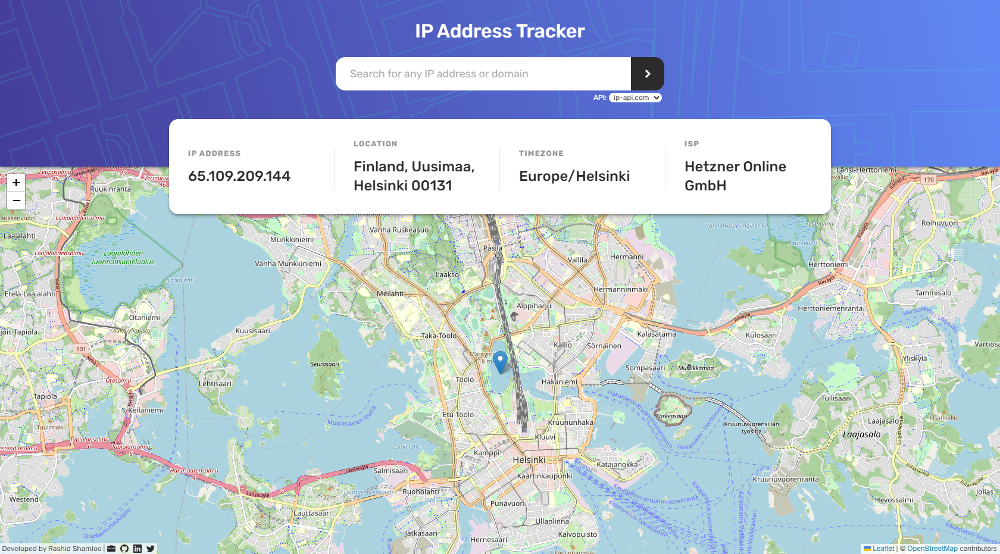
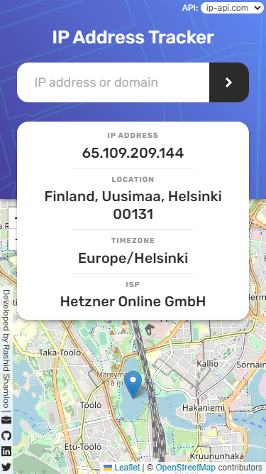

# Front End Mentor - Project 033 - IP Address Tracker

This is a solution to the [IP Address Tracker challenge on Frontend Mentor](https://www.frontendmentor.io/challenges/ip-address-tracker-I8-0yYAH0).

## Table of contents

- [Overview](#overview)
  - [Screenshot](#screenshot)
  - [Links](#links)
  - [Blog Posts](#blog-posts)
- [My process](#my-process)
  - [Summary](#summary)
  - [Built with](#built-with)
  - [What I learned](#what-i-learned)
  - [Useful resources](#useful-resources)
- [Author](#author)

## Overview

### Screenshot

- Desktop



- Mobile



### Links

- Solution URL: https://github.com/rashidshamloo/fem_033_ip-address-tracker/
- Solution URL (backend): https://github.com/rashidshamloo/fem_033_ip-address-tracker_backend/
- Live Site URL: https://rashidshamloo.github.io/fem_033_ip-address-tracker/

### Blog posts

- [Adding timeout and multiple abort signals to fetch() (TypeScript/React)](https://dev.to/rashidshamloo/adding-timeout-and-multiple-abort-signals-to-fetch-typescriptreact-33bb)

## My process

### Summary

 - Made the frontend in React
 - After deploy, ipify API was blocked by ad block and another API gave the `Access-Control-Allow-Origin missing` error
 - Explored using a cors proxy and writing one in Node/Express
 - Decided to expand on it and move all public API calls / API keys to the backend for more security
 - Learned Node.js/Express + TypeScript + custom middleware
 - Got `Serverless function timed out` error from Vercel
 - Added timeout to fetch using AbortSignal
 - Used the same function in frontend React but needed another signal so modified the function.
 - Decided to publish the function as a package on NPM but needed to write tests for it
 - Learned Jest + TypeScript
 - Published the package and modified both frontend and backend to use it instead

### Built with

#### Front-end:

- Vite / React.js
- Tailwind CSS
- Leaflet.js (React Leaflet)
- TypeScript

#### Back-end:

- Node.js
- Express.js
- TypeScript

### What I learned

- Using [`ipify`](https://www.ipify.org/) API to show IP geolocation information
- Using `white-space: pre-line;` in CSS to add line breaks with `\n` in code
- Implementing a loading component and using `state` to show it while fetching data from API
- Using `react-loading` package to display loading animations
- Using `ip-regex` package for ipv4/ipv6 validation
- Using `react-toastify` package to add notifications
- Using [`leafletjs`](https://leafletjs.com/) and [`react-leaflet`](https://react-leaflet.js.org/) package to show the map
- Using a child component of `<MapContainer>`, `useMap()` hook, and `flyTo()` and `setView()` functions to update the center of the map
- Adjusting the map center by changing the lat/lng position to compensate for UI elements
- Using states to apply different map movements / display for first and subsequent renders
- Using `.env` and `.env.local` files to store API keys and importing them with `import.meta.env.VARIABLE`
- Implementing auto size/width for the API select element using a temp select element's width
- Aborting a fetch request in `useEffect()` on component unmount by returning a clean-up function and AbortController/Signal
- Saving API choice to `localStorage` and using it as default the next time app loads
- Implementing a back-end API using Node.js and Express 
- Moved all Public API requests and formatting of responses to the back-end. so in the front-end i can make a request to it and receive nicely formatted JSON while the API keys are hidden.
- What `cors` is and implementing 'cors' in the back-end API to only allow `Origin` of `https://rashidshamloo.github.io` using `cors()` middleware
- Implemented IP rate limiting in the back-end API using "express-rate-limit" package (later changed to 'rate-limiter-flexible')
- Chaining multiple middlewares in Express
- Assigning a value to multiple variables in one line using destructuring:
```javascript
let [ip, isp, location, timezone] = Array(4).fill("");
```
- Adding security to the Express API by checking for a token (similar to API key)
- Writing custom middleware to handle token authentication
- Adding timeout to fetch requests using `abortController()` to return error in case of timeout
- writing custom middleware to add extra fields to all `res.json()` calls
- Using `res.sendFile()` and `res.redirect()`
- Getting data from `req.body` in `POST` requests
- Using `rate-limiter-flexible` package for rate limiting in Express.js
- As an offshoot of this challenge, i also learned:
  - Using Jest with Typescript and testing asynchronous functions in Jest
  - Publishing Packages to NPM registry
  - Different export methods (module.exports and export ...) to allow importing using both `import` and `require`
  - Allowing functions to accept both an Array and arguments as input
  - Overloading arrow functions
  - Writing intellisense comments for functions in JSDoc format
  - Different types in TypeScript (`tuple`, `returnType<typeof ...>`, Array with certain types in certain positions, etc.)
  - Using `events.setMaxListeners()` to set the maximum event listener number
  - Deploying a backend Node/Express API to Vercel and setting environment variables for different API keys
  - Using my `fetch-multi-signal` package to add timeout to Express fetch requests to fix the `Serverless function has timed out` error in Vercel

### Useful resources

- [react-loading](https://www.npmjs.com/package/react-loading) - Used for showing a loading animation for when the map loads and data is being retrieved from the API
- [ip-regex](https://www.npmjs.com/package/ip-regex) - Used for IP validation
- [react-toastify](https://www.npmjs.com/package/react-toastify) - Used for showing pop-up error messages
- [react-leaflet](https://react-leaflet.js.org/) - Used for showing the map / integrating Leaflet.js into React
- [express-rate-limit](https://www.npmjs.com/package/express-rate-limit) - Used for adding rate-limiting to Express.js (later used the package below instead)
- [rate-limiter-flexible](https://www.npmjs.com/package/rate-limiter-flexible) - Used for adding rate-limiting to Express.js
- [fetch-multi-signal](https://www.npmjs.com/package/fetch-multi-signal) - Used for adding timeout to fetch requests in backend(Node/Express) and adding timeout and abort signal to fetch in frontend(React)

## Author

- Portfolio - [rashidshamloo.ir](https://www.rashidshamloo.ir)
- Linkedin - [rashid-shamloo](https://www.linkedin.com/in/rashid-shamloo/)
- Frontend Mentor - [@rashidshamloo](https://www.frontendmentor.io/profile/rashidshamloo)
- Twitter - [@rashidshamloo](https://www.twitter.com/rashidshamloo)
- Dev.to - [@rashidshamloo](https://dev.to/rashidshamloo)
